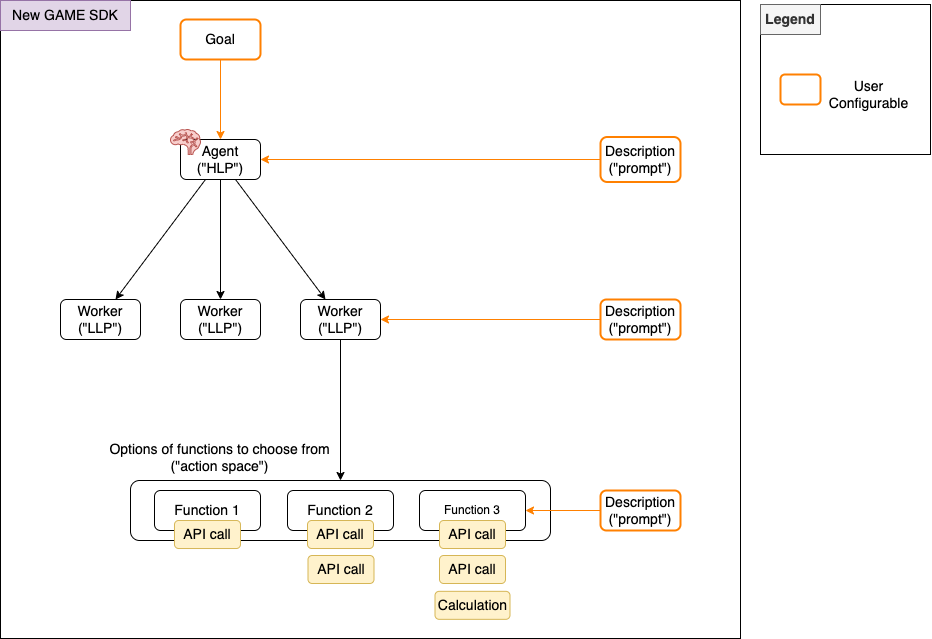

## Usage
This is the github repo for our NPM package.

Request for a GAME API key in the Game Console. https://console.game.virtuals.io/
If you have any trouble, contact Virtuals support or DevRel team members via Discord or Telegram.

### 1. Functions and Executables

Functions define available actions for the agent:

```typescript
import {
  GameFunction,
  ExecutableGameFunctionResponse,
  ExecutableGameFunctionStatus,
} from "@virtuals-protocol/game";

const myFunction = new GameFunction({
  name: "action_name",
  description: "Description of action",
  args: [
    { name: "param", type: "type", description: "param description" },
  ] as const,
  executable: async (args) => {
    try {
      // Implement your function logic here
      return new ExecutableGameFunctionResponse(
        ExecutableGameFunctionStatus.Done,
        "Action completed successfully"
      );
    } catch (e) {
      return new ExecutableGameFunctionResponse(
        ExecutableGameFunctionStatus.Failed,
        "Action failed"
      );
    }
  },
});
```

Executable functions must return an instance of `ExecutableGameFunctionResponse` with:

- `ExecutableGameFunctionStatus`
- Feedback message

### 2. State Management

Easy and flexible way to define the state management, what the agent sees and how that changes.

```typescript
async function getAgentState(): Promise<Record<string, any>> {
  return {
    health: 100,
    inventory: ["sword", "shield", "potion"],
  };
}
```

### 3. Workers

Workers are simple interactable agents that execute the tasks defined by the user. They can be specialized agents with defined capabilities:

```typescript
import { GameWorker } from "@virtuals-protocol/game";

const worker = new GameWorker({
  id: "worker_id",
  name: "Worker Name",
  description: "Worker description",
  functions: [list_of_functions],
  getEnvironment: async () => {
    return {
      // environment details
    };
  },
});
```

Key features:

- Can be shared or unique per worker
- Processes function execution results to update state

### 4. Agents

Agents are used to autonomously function in an open-ended manner by just providing a general goal. Tasks are generated by the agent itself continuously, and the agent will attempt to complete them. You can provide many workers to the agent, and they will be used to execute the tasks.

```typescript
import { GameAgent } from "@virtuals-protocol/game";

const agent = new GameAgent("your_api_key", {
  name: "Agent Name",
  goal: "Primary goal",
  description: "Description",
  getAgentState: agent_state_function,
  workers: [worker1, worker2],
});

// Compile and run
await agent.init();
await agent.run();
```

In this example, the custom logger will print the agent's name followed by the log message to the console. You can customize the logger function to handle log messages in any way you prefer, such as writing them to a file or sending them to a logging service.

### Using the Logger in Custom Functions

You can use the logger within your custom functions to log messages. The logger is passed as an argument to the executable function. Here's an example of how to use the logger in a custom function:

```typescript
const customFunction = new GameFunction({
  name: "custom_action",
  description: "A custom action with logging",
  args: [{ name: "param", description: "Parameter for the action" }] as const,
  executable: async (args, logger) => {
    try {
      logger(`Executing custom action with param: ${args.param}`);
      // Implement your function logic here
      return new ExecutableGameFunctionResponse(
        ExecutableGameFunctionStatus.Done,
        "Custom action completed successfully"
      );
    } catch (e) {
      logger(`Failed to execute custom action: ${e.message}`);
      return new ExecutableGameFunctionResponse(
        ExecutableGameFunctionStatus.Failed,
        "Custom action failed"
      );
    }
  },
});
```

In this example, the logger is used to log messages before and after the execution of the custom action. This helps in tracking the function's execution flow and any errors that occur.

### Running the Agent

The agent will initialize and start running, performing actions such as posting tweets, searching for tweets, and replying to tweets at regular intervals.

```typescript
await agent.init();
// running at a fix interval of 60 seconds
await agent.run(60, {
  /**
   * @property {boolean} verbose - A flag to enable or disable verbose logging.
   *
   * @description
   * The `verbose` property is used to control the verbosity of the logging output.
   * When set to `true`, detailed logs will be generated, which can be useful for
   * debugging and development purposes. When set to `false`, only essential logs
   * will be produced, reducing the amount of log output.
   */
  verbose: true | false,
});
```

#### Running Agent (without fix interval)

With the step function app has more control over in interval

```typescript
await agent.step();
```


## Installation

To install the package, run:

```bash
npm install @virtuals-protocol/game
```

## Game-starter
In the `game-starter` folder is a starter project that will get you up and running with a working agent in minutes. 

Go into the folder's readme for instructions are on how to get started.


## Examples
In the `examples` folder, there are two self contained examples: a twitter agent and a telegram agent. 

Just compile with `npm run build` and `npm start` to run! (make sure you have an API key first!)

## Plugins
In the `plugins` folder are various plugins that can give your agent more functionality. 

Each plugin comes with an example file. Click into the plugin's src folder to run the `example.ts` file!

Plugins are always open source and we welcome contributions! 


## Components and Architecture Overview

At a high level, this SDK allows you to develop your agents powered by the GAME architecture in its most full and flexible form. The SDK is made up of 3 main components (Agent, Worker, function), each with configurable arguments. Our docs expands in greater depth [G.A.M.E Docs](https://docs.game.virtuals.io/game-sdk).





Agent (a.k.a. [high level planner](https://docs.game.virtuals.io/game-cloud#high-level-planner-context))
- Takes in a <b>Goal</b>
  - Drives the agent's behavior through the high-level plan which influences the thinking and creation of tasks that would contribute towards this goal
- Takes in a <b>Description</b>
  - Combination of what was previously known as World Info + Agent Description
  - This includes a description of the "world" the agent lives in, and the personality and background of the agent

Worker (a.k.a. [low-level planner](https://docs.game.virtuals.io/game-cloud#low-level-planner-context)) 
- Takes in a <b>Description</b>
  - Used to control which workers are called by the agent, based on the high-level plan and tasks created to contribute to the goal

Function
- Takes in a <b>Description</b>
  - Used to control which functions are called by the workers, based on each worker's low-level plan
  - This can be any executable

## Run agent in TEE

Head to the [game-starter README](./game-starter/README.md#to-run-project-in-phala-tee) for more detailed instructions.

## License

This project is licensed under the MIT License.

## Twitter Integration

### OAuth Authentication
The application uses OAuth 1.0a to authenticate with the Twitter API v2. The implementation in `src/workers/tweetWorker.ts` ensures proper authentication by:

1. Generating an OAuth signature based on the request method, URL, and parameters
2. Creating the authorization header with all required OAuth parameters
3. Sending the request with the proper headers to the Twitter API

The OAuth implementation has been recently updated to fix authentication issues by:
- Removing the `data` property from the `request_data` object when generating the OAuth signature
- Updating the OAuth header formatting to use `Object.entries()` for improved type safety
- Adding detailed logging of the OAuth header for debugging purposes

#### Testing Twitter API Authentication
A test script is available to verify the Twitter API authentication:

```bash
# Run the Twitter API test
npx ts-node src/test-tweet.ts
```

This test:
1. Creates a test tweet with a timestamp
2. Generates the OAuth signature and headers
3. Posts the tweet to the Twitter API
4. Verifies the response and displays the tweet ID if successful

### Rate Limiting
The application implements rate limiting for Twitter API requests to comply with Twitter's guidelines:

1. **Token-Based Rate Limiting**: Using a token bucket algorithm that allows bursts of requests while maintaining a long-term average rate
2. **Per-Function Limits**: Different functions (posting tweets, checking mentions, searching) have separate rate limits
3. **Scheduled Operations**: Tweets, mentions, and searches are scheduled at appropriate intervals to avoid hitting rate limits

To modify rate limits, adjust the following settings:
- Tweet posting: Controlled by the `initializeAndScheduleTweets` function in `src/index.ts`
- Mention checking: Configured in the `initializeAndScheduleMentions` function
- Tweet searching: Set in the `initializeAndScheduleTweetSearches` function

### LLM Integration for Tweet Generation
The application uses the DeepSeek-R1 LLM model to generate tweets. The implementation ensures:

1. Tweets are generated based on cultural context and current events
2. Content is appropriate and aligned with the agent's personality
3. Tweets are within the character limit and properly formatted

To test LLM connectivity:
```bash
# Run the LLM usage test
npx ts-node src/test-llm-usage.ts
```

This test verifies:
- API key configuration
- LLM model settings
- Required environment variables

## Testing

The project includes test scripts to verify key functionality:

### Twitter API Testing
Run the Twitter API test with:
```bash
npx ts-node src/test-tweet.ts
```
This verifies the OAuth implementation by posting a test tweet.

### LLM Usage Testing
Verify that the application is using the LLM via the game API key:
```bash
npx ts-node src/test-llm-usage.ts
```

### Worker Functionality Testing
Test the initialization and functionality of all workers:
```bash
npx ts-node src/test-workers.ts
```
